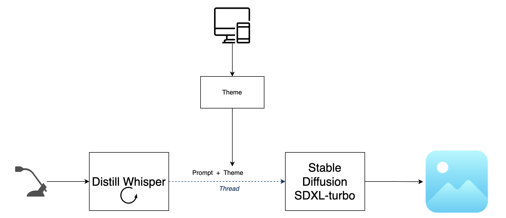

# Realtime speech to image with theme selection


## Program flow


## How to run

```
./run.sh
```

Navigate to [http://127.0.0.1:7860](http://127.0.0.1:7860) to select the theme in realtime.

Start talking into your microphone and images will start appearing in realtime in the `.img` directory
